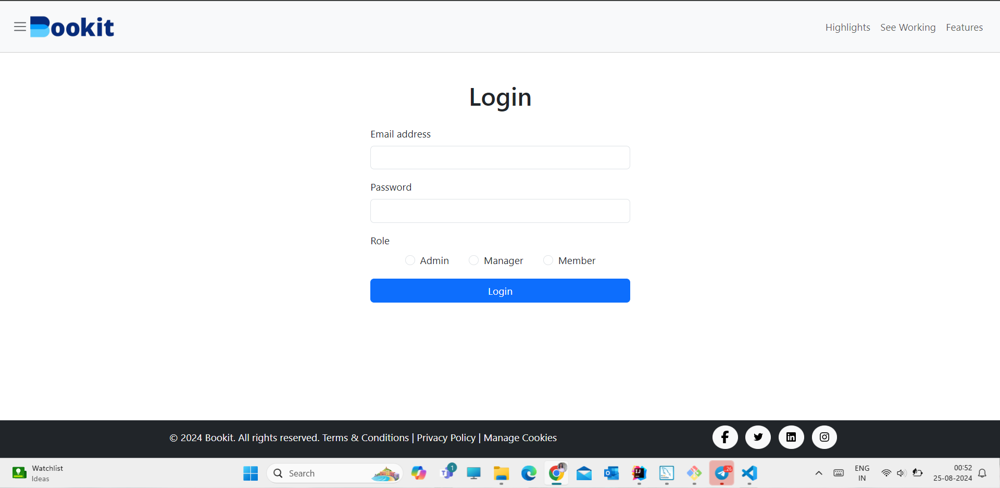
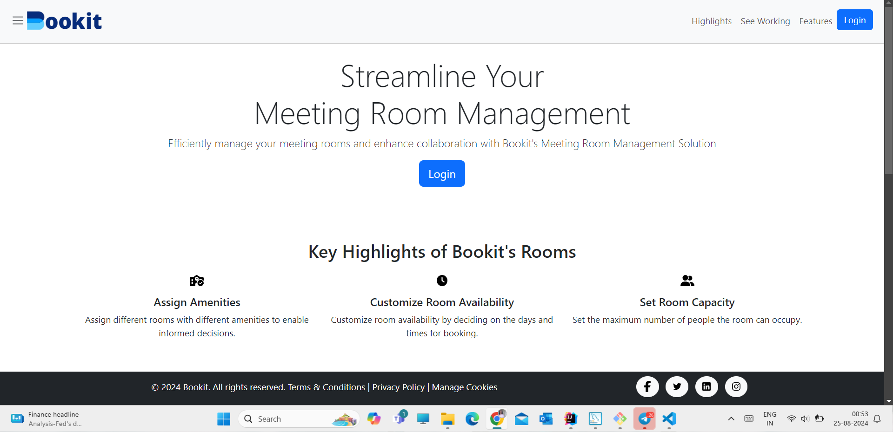
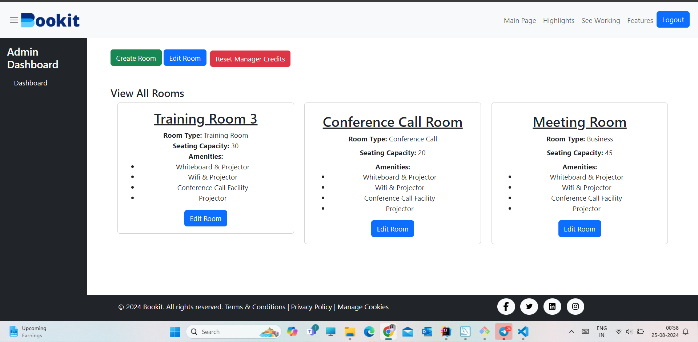
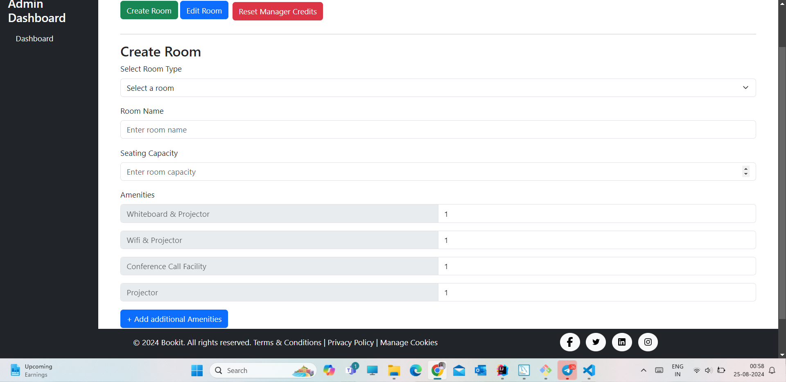
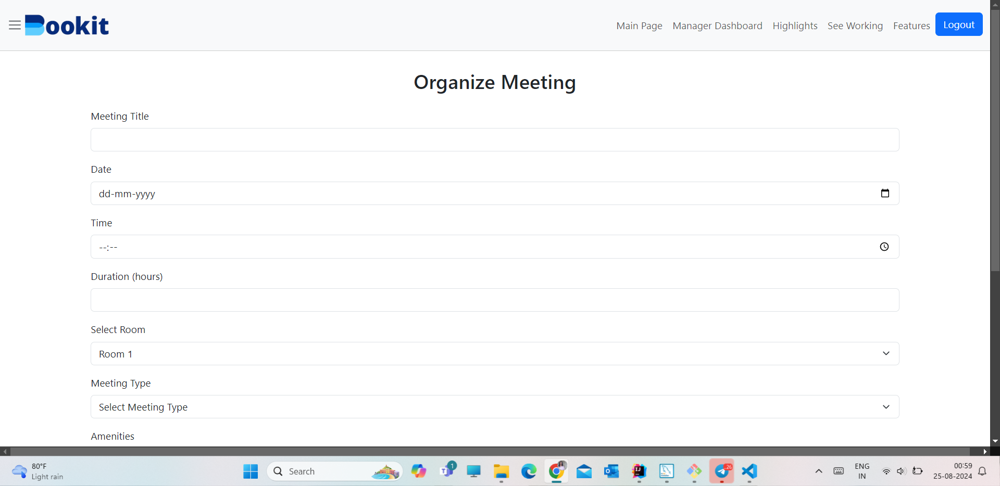

# Bookit

## Overview

**BOOKIT** is a comprehensive meeting room management solution designed to streamline the process of booking meeting spaces, managing amenities, and enhancing overall collaboration within an office environment. The system includes three user roles—Admin, Manager, and Member—each with specific functionalities to efficiently manage and utilize meeting rooms.

## Features

- **Admin Module**:  
  - Create and configure meeting rooms.
  - Reset manager credits on a weekly basis.
  
- **Manager Module**:  
  - Book available meeting rooms based on real-time availability.
  - Customize room settings by selecting from available amenities (WiFi, TV, water dispenser, whiteboard, etc.).
  - Configure room capacity and time slots.
  - Manage weekly credits (2000 points) allocated every Monday, with credits deducted based on selected amenities and room configurations.

- **Member Module**:  
  - View scheduled meetings, including details on time, room, and selected amenities.
  
## Technology Stack

- **Frontend**: HTML, CSS, JavaScript (Implemented with dummy data for demonstration)
- **Backend**: Java, MySQL (For database management and backend logic)
  
## Documentation

**BOOKIT** provides a seamless interface and backend support to handle all aspects of meeting room management:

- **Efficient Room Booking**: Enables managers to book rooms quickly based on current availability.
- **Amenities Booking**: Allows pre-selection of room amenities to ensure all necessary equipment and resources are available during meetings.
- **Credit Management**: Ensures that managers stay within their allocated budget through an intuitive credit system, promoting efficient use of resources.
  
## Screenshots
1. Login Page:

3. Highlights Page:
   

5. Admin Page:
   

7. Create Room Page:
   

9. Organize Meeting Page:

    

_Include screenshots of the key interfaces: Admin Dashboard, Manager Booking Page, Member View, etc._

## Installation & Setup

1. Clone the repository:  
   `git clone https://github.com/yourusername/bookit.git`
2. Navigate to the project directory:  
   `cd bookit`
3. Set up the backend:
   - Configure your MySQL database and update the connection settings in the backend.
   - Run the backend server using your preferred Java IDE or command line.
4. Run the frontend:
   - Open `index.html` in your browser or use a local server to host the frontend files.
  
## Contributing

Contributions are welcome! Please fork this repository, make your changes, and submit a pull request.

## Credits

- **Developed by**: Your Team Name or Individual Name
- **Design**: Your Design Team
- **Testing**: Your Testing Team

## License

© 2024 Bookit. All rights reserved.  
- [Terms & Conditions](#)
- [Privacy Policy](#)
